# Hi, I'm Felix Helleckes 👋
## Senior QA Automation Engineer | Software Quality Specialist

I am a Quality Assurance expert with over 8 years of experience in building robust automation frameworks 
and ensuring the reliability of business-critical software systems. 

### 🚀 Technical Expertise
- **Languages:** JavaScript, TypeScript, Java, Python, Kotlin
- **Testing Tools:** Playwright, Webdriver.io, loust.io, Speedcurve, SAP Testing Framework, Postman (API Testing), Jira/XRAY, Testrail, Microfocus UFT, VSCode, Browserstack
- **CI/CD & DevOps:** Jenkins, GitHub Actions, Docker, Kubernetes
- **Focus:** E2E Testautomation, AI-driven Test Automation, Performance Testing
- **Environment:** Linux, Windows, macOS, Android, iOS

  
### 🛠 Projects & Focus 2026
I am currently focusing on **AI-integrated testing environments** and modern **Cloud-Native QA architectures**. 
Check out my repositories below to see my work with Playwright and modern CI pipelines.

---

### 📱 Apps I built & shipped

Side projects, all published and publicly available — built end to end, from the code to the store listing.

| App | What it is | Stack |
|---|---|---|
| **[Moto-Log](https://motologbuch.netlify.app/)** | 100% offline service logbook for motorcycles — maintenance entries, service intervals and running costs. No account, no trackers. iOS & Android, five languages. | Flutter |
| **[EU Compliance Suite](https://eu-compliance-suite.fly.dev/)** | Shopify app for three EU consumer-law obligations taking effect in 2026: withdrawal button (Art. 11a CRD), legal-guarantee notice and the GARAN label (Reg. (EU) 2025/1960) — 24 languages, no theme code. | React Router 7, Prisma, Polaris, GraphQL Admin API |
| **[Mega Man: Advanced PET](https://mega-man-advanced-pet.vercel.app/)** | Fan-made mobile game: real-time 3×6 grid NetBattles, 200+ battle chips with fusion, co-op boss raids and a pedometer that charges battle fuel while you walk. | Flutter, Supabase |
| **[Clickwheel](https://clickwheel-app.netlify.app/)** | Offline music player with a real click wheel that rotates by angle and clicks audibly. No streaming, no ads, no connection. | Flutter |
| **[World Clock Live](https://worldclocklive.pages.dev/)** | LED world clock as a live desktop wallpaper for Windows and macOS — 24 cities, 7-segment digits, automatic DST, near-zero CPU usage. | Electron |
| **[Retrogram](https://icq-remake.netlify.app/)** | A retro ICQ-style messenger, rebuilt for the browser. | Web |

---

### 💼 Professional Journey & Impact

**Senior Quality Assurance Engineer | E-Commerce (Bike24)**
*2023 – 2025*
* Specialized in high-performance QA strategies for large-scale retail platforms in SAP and Webfrontend (Playwright)

**QA Manager & Automation Lead | Fashion Digital GmbH**
*2021 – 2023*
* **webdriver.io:** Architected modern E2E test suites for enterprise-level Web systems.
* **Performance Testing:** Implemented Locust.io (Python) for stress-testing web architectures.
* **Infrastructure:** Managed and configured QA environments within Kubernetes clusters.

**Test Automation Specialist | ampada GmbH**
*2021*
* Specialized in E2E automation with Javascript/Gherkin and legacy Desktop automation (VisualBasic/UFT).

**QA Engineer | grandcentrix GmbH**
*2018 – 2021*
* Focused on **IoT and App development**.
* Built mobile automation frameworks with Appium and led API testing initiatives using Postman.

**Independent QA Consultant | Gaming Industry**
*2015 – 2018*
* Conducted manual and specialized testing for global leaders in the gaming industry (e.g., Blizzard Entertainment).

---

### 🧠 My QA Philosophy
I bridge the gap between development and business requirements. By implementing "Shift-Left" strategies and automated quality gates, I ensure that stability is a feature, not an afterthought.

### 📫 Let's connect
- **Portfolio:** [felix-helleckes.github.io](https://felix-helleckes.github.io/)
- **LinkedIn:** [linkedin.com/in/felix-helleckes](https://www.linkedin.com/in/felix-helleckes/)
- **Xing:** [xing.com/profile/Felix_Helleckes](https://www.xing.com/profile/Felix_Helleckes)
- **Stack Overflow:** [stackoverflow.com/users/15774380](https://stackoverflow.com/users/15774380/felix-helleckes)
- **Tech blogs:** [dev.to/felix-helleckes](https://dev.to/felix-helleckes) · [felix-helleckes.medium.com](https://felix-helleckes.medium.com/)
- **Apps:** [App Store](https://apps.apple.com/de/developer/felix-helleckes/id6786716900) · [Google Play](https://play.google.com/store/apps/developer?id=Felix+Helleckes)
- **Mail:** f.helleckes@proton.me

---
*Senior QA Engineer based in Cologne, Germany.*
*Professionalism, Quality, and Reliability in Software Development.*
